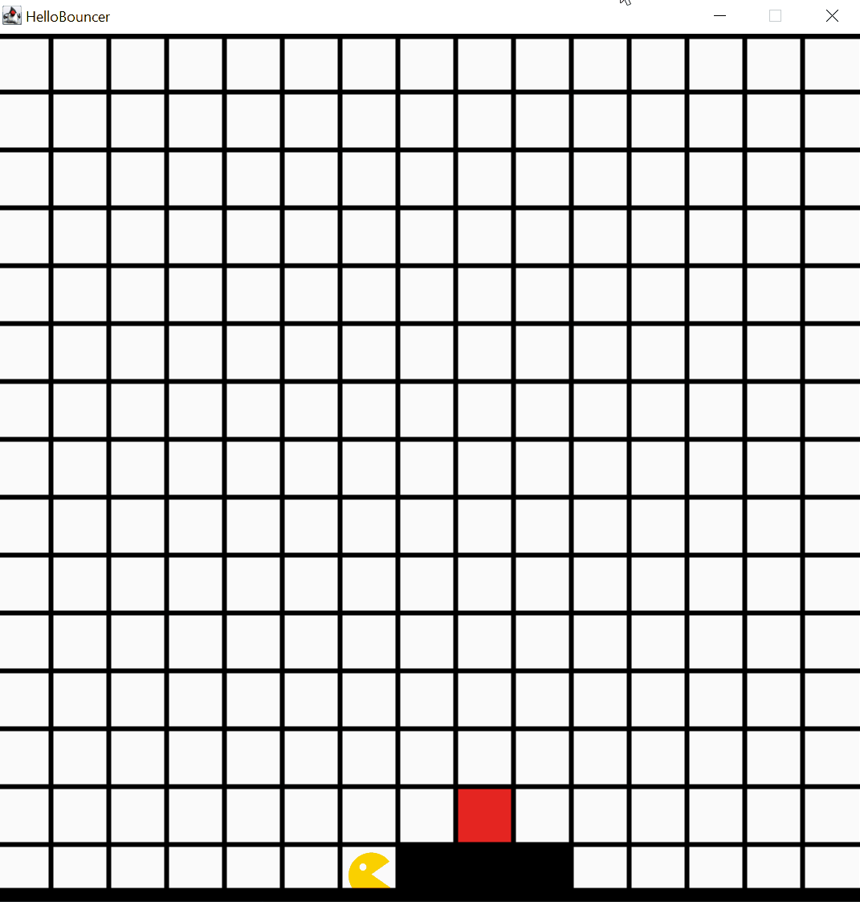

# Hello Bouncer

In diesem ersten Bouncer-Program bewegt sich Bouncer ausgehend von seiner Startposition auf ein vor ihm liegendes Plateau
und bleibt auf einem rot eingefärbten Feld stehen.

## Relevante Bezüge zum OOP-Kurs

Diese Demo kann als erstes Beispiel für ein selbst-geschriebenes Programm verwendet werden. Aufbauend auf einem minimalen Set an Befehlen wird der Startvorgang und die sequenzielle Abarbeitung der einzelnen Befehle innerhalb eines JAVA-Programms demonstriert.

- Struktureller Aufbau und Verwendung eines Bouncer-Programms
- `main`-Methode als allgemeiner Einstieg in die Ausführung von JAVA-Programmen
- Notation von Steuerungsbefehlen in der `bounce`-Methode
- Initiales Laden von Weltzuständen über `loadMap`
- Steuerung von Bouncer über `move` und `turnLeft`
- Verwendung von Kommentaren zur zusätzlichen Beschreibung von Programmabläufen